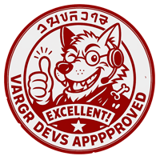
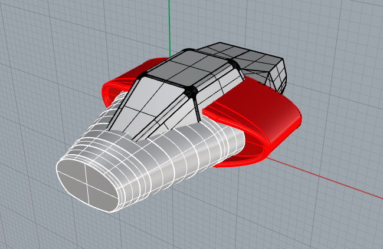
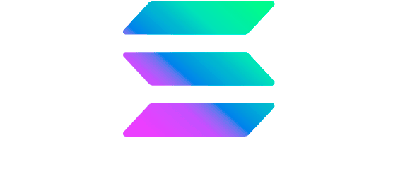

# Notas de Diseño


{% column width="75%" %}

RRRGHA UDHEG! - ¡LLAMADA A LA COMUNIDAD!\
Los desarrolladores Vargr rugimos y aullamos porque nos arden las garras —y que quede claro: sí, lo necesitamos.\
Sabemos movernos, sabemos pelear, pero juntos somos manada, y juntos llegamos más lejos.\
Si tienes garras, cerebro o ganas, únete.\
No es por gloria, es por el camino.\
DHRAGHZ UDHEG, AURR!




<figure><figcaption></figcaption></figure>



***

> #### Bilanidin y otras lenguas alienígenas
>
> **Bilanidin** es el alfabeto oficial vilani. En el Tercer Imperio comparte estatus oficial con el _Galanglico_ (inglés galáctico).\
> Existen [publicaciones](https://wiki.travellerrpg.com/Vilani_Grammar_and_Glossary) sobre la gramática vilani y el uso del Bilanidin, pero los textos presentados en esta documentación y en el material publicado de TCW no han sido revisados exhaustivamente y pueden contener errores.
>
> A lo largo de los años se han creado diversos sistemas y reglas para la generación de textos en lenguas alienígenas del universo Traveller.\
> Como no existe un referente exhaustivo, las lenguas alienígenas están adaptadas siguiendo reglas similares y nuestro propio criterio.\
> —Nath'k'rrg urrp'thinz, udheg

***



<figure><figcaption></figcaption></figure>




🎨 **¡SE BUSCAN ARTISTAS 3D!** 🚀

Buscamos:\
✅ Modeladores (cualquier software que exporte a .fbx)\
✅ Artistas de materiales y texturas\
✅ Animadores\
✅ Especialistas en efectos Niagara

🎮 Entorno principal: Unreal Engine.\
💬 Además de colaborar en un proyecto ambicioso, tendrás la oportunidad de aprender, crecer y perfeccionar tus habilidades junto a un equipo motivado.




***


#### ¿Quieres unirte?

🧠 Seas programador, artista, diseñador de sistemas, o simplemente un loco del universo _Traveller_, **te estamos esperando**.

📡 Puedes contactar directamente con el equipo de desarrollo a través de:

* 💬 **Discord:** [discord.gg/thecorporatewars](https://discord.gg/gqrmE6FBKQ)
* 📧 **Email:** `developers@thecorporatewars.com`

No prometemos fama ni fortuna, pero sí **buena compañía, libertad creativa y trabajo significativo**.

**DHRAGHZ UDHEG, AURR!**\
¡Nos vemos entre estrellas!




<figure><figcaption></figcaption></figure>



<figure><figcaption></figcaption></figure>



<figure><figcaption></figcaption></figure>



<figure><figcaption></figcaption></figure>


