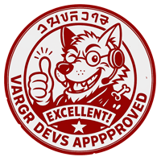

# Designer Notes


{% column width="75%" %}

**RRRGHA UDHEG! - COMMUNITY CALL!**\
We Vargr developers raise the howl as this burns in our claws —and let it be clear: **yes**, we need this.\
We know how to move, we know how to fight, but together we are pack, and together we go farther.\
If you've got claws, brains, or drive, join us.\
It's not for glory —it's for the journey.\
**DHRAGHZ UDHEG, AURR!**




<figure><figcaption></figcaption></figure>



***

> 
<strong>Bilanidin and other alien languages</strong>

>
> **Bilanidin** is the official Vilani alphabet. In the Third Imperium, it shares official status with _Galanglic_ (Galactic English).\
> There are [publications](https://wiki.travellerrpg.com/Vilani_Grammar_and_Glossary) on Vilani grammar and the use of Bilanidin, but the texts presented in this documentation and in the TCW's published materials have not been thoroughly reviewed and may contain errors.
>
> Over the years, various systems and rules have been created for generating texts in the alien languages of the Traveller universe. Since there is no exhaustive reference, the alien languages are adapted following similar rules and our own judgment.\
> -Nath'k'rrg urrp'tinz, udheg

***



<figure><figcaption></figcaption></figure>




🎨 **LOOKING FOR 3D ARTISTS!** 🚀

We are looking for:\
✅ Modelers (any software that can export to .fbx)\
✅ Material and texture artists\
✅ Animators\
✅ Niagara effects specialists

🎮 Main environment: Unreal Engine.\
💬 In addition to collaborating on an ambitious project, you'll have the opportunity to learn, grow, and refine your skills alongside a motivated team.




***

### Want to Join?

🧠 Whether you're a programmer, artist, systems designer, or just a *Traveller* fanatic — **we're waiting for you**.

📡 You can reach out to the development team directly via:

- 💬 **Discord:** [discord.gg/thecorporatewars](https://discord.gg/gqrmE6FBKQ)
- 📧 **Email:** `developers@thecorporatewars.com`

We don’t promise fame or fortune, but you’ll find **great company, creative freedom, and meaningful work**.

**DHRAGHZ UDHEG, AURR!**  
See you among the stars!
