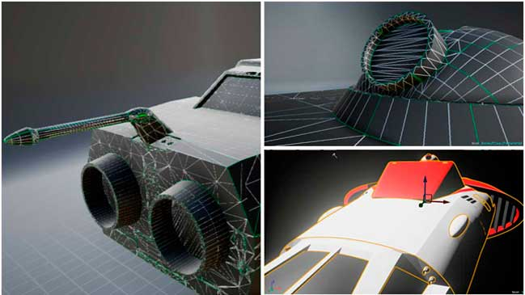

# Designer Notes


{% column width="75%" %}

**RRRGHA UDHEG! - COMMUNITY CALL!**\
We Vargr developers raise the howl as this burns in our claws —and let it be clear: **yes**, we need this.\
We know how to move, we know how to fight, but together we are pack, and together we go farther.\
If you've got claws, brains, or drive, join us.\
It's not for glory —it's for the journey.\
**DHRAGHZ UDHEG, AURR!**




<figure><figcaption></figcaption></figure>



***

> 
<strong>Bilanidin and other alien languages</strong>

>
> **Bilanidin** is the official Vilani alphabet. In the Third Imperium, it shares official status with _Galanglic_ (Galactic English).\
> There are [publications](https://wiki.travellerrpg.com/Vilani_Grammar_and_Glossary) on Vilani grammar and the use of Bilanidin, but the texts presented in this documentation and in the TCW's published materials have not been thoroughly reviewed and may contain errors.
>
> Over the years, various systems and rules have been created for generating texts in the alien languages of the Traveller universe. Since there is no exhaustive reference, the alien languages are adapted following similar rules and our own judgment.\
> -Nath'k'rrg urrp'tinz, udheg

***



<figure><figcaption></figcaption></figure>




🎨 **¡SE BUSCAN ARTISTAS 3D!** 🚀

Buscamos:\
✅ Modeladores (cualquier software que exporte a .fbx)\
✅ Artistas de materiales y texturas\
✅ Animadores\
✅ Especialistas en efectos Niagara

🎮 Entorno principal: Unreal Engine.\
💬 Además de colaborar en un proyecto ambicioso, tendrás la oportunidad de aprender, crecer y perfeccionar tus habilidades junto a un equipo motivado.




***
